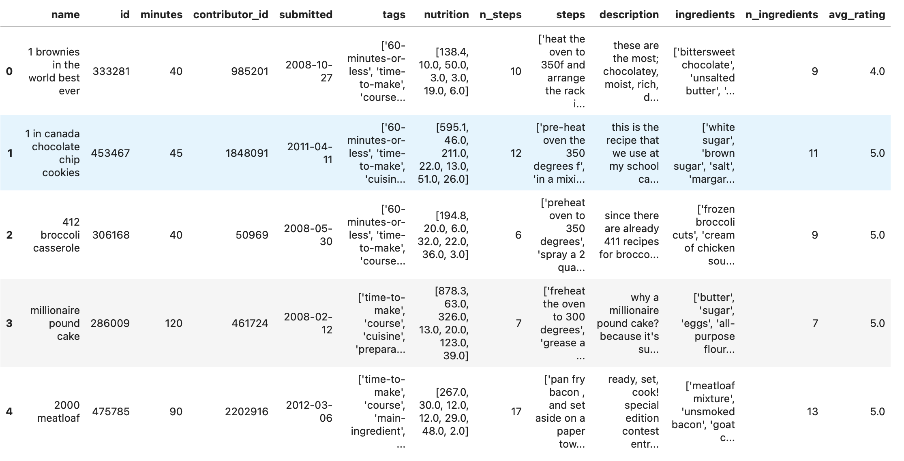

# Recipe Ratings Analysis
### By Anna Rosenbaum and Shourya Kulkarni

This project investigates recipes and ratings from Food.com to answer: 
**Do recipes with more ingredients receive higher average ratings?**

# **Introduction:** 
The recipes and ratings dataset holds recipes and ratings from food.com. The data was originally scraped and used for other data analysis. There are two CSVs in the dataset, one that contains the recipes and the other contains the reviews and ratings submitted for the recipes. The overarching question we are hoping to answer is, What types of recipes tend to have higher average ratings? More specifically, we are looking to answer; Do recipes with more ingredients recieve higher average ratings than recipes with fewer ingredients. 

The importance of the dataset as well as the question being answered is based on the consumer process. It is important to know whether a recipe was rated highly if it contains expensive ingredients and could more ingredients signal a longer prep or cook time which means more time away from work, family, or friends. 

In the raw recipes dataset, there are 83,782 rows and 12 columns. The interactions dataset contains 721,927 rows and 5 columns. For the raw recipes, the main columns that are important to our analysis are the name, minutes, n_steps, and description. These columns indicate the recipe name, recipe ID, the number of minutes to prepare the recipe, the number of steps in the recipe, and the user-provided description. In the interactions dataset, the most important columns are the recipe ID, rating, and review columns. 

The two datasets were merged together during the data cleaning process and the final dataset contained 83,782 rows and 13 columns. The new column being the average rating. 

 # **Data Cleaning and Exploratory Data Analysis** 
Before beginning to look at the dataset in an analytical way, the dataset needed to be cleaned. Specifically it was important to merge the two datasets; raw recipes and interactions together to prodcue one workable dataset. After merging, a column needed to be added to find the average rating for the recipes from the interactions dataset. This was done by first fill all ratings of 0 with np.nan. The main reason for this is because it is the first step in distinguishing between an actual rating of 0 and a missing rating value. This also allows us to prevent skew when averaging it as 0s do affect the average.

**Head of Dataset**

**Univariate Analysis** insert plotly 
**Bivariate Analysis** insert plotly 
**Pivot table** insert plot 

# **Assessment of Missingness**

**MNAR Analysis**

We believe the `description` column is MNAR. Recipes without descriptions are likely ones where the contributor did not feel the recipe needed explanation, meaning the missingness depends on the recipe itself (such as very simple recipes), not on any observed column. We assess the missingness of the `rating` column in the merged dataset, which contains 15,036 missing values out of 234,429 rows. We test whether this missingness depends on two other columns: `minutes` and `n_ingredients`.

**Missingness Dependency**

We assess the missingness of the `rating` column in the merged dataset, which contains 15,036 missing values out of 234,429 rows. We test whether this missingness depends on 
two other columns: `minutes` and `n_ingredients`.

- **Null Hypothesis:** The missingness of `rating` does not depend on `minutes`.
- **Alternative Hypothesis:** The missingness of `rating` does depend on `minutes`.
- **Test Statistic:** Difference in mean `minutes` between recipes with and without missing ratings.
- **Significance Level:** 0.05
- **Observed Difference:** 51.45 minutes
- **P-value:** 0.124

#insert plotly graph here

Since the p-value (0.124) is greater than 0.05, we fail to reject the null hypothesis. The missingness of `rating` does **not** depend on `minutes`.

- **Null Hypothesis:** The missingness of `rating` does not depend on `n_ingredients`.
- **Alternative Hypothesis:** The missingness of `rating` does depend on `n_ingredients`.
- **Test Statistic:** Difference in mean `n_ingredients` between recipes with and without missing ratings.
- **Significance Level:** 0.05
- **Observed Difference:** 0.1607
- **P-value:** 0.0

#insert plotly graph here

Since the p-value (0.0) is less than 0.05, we reject the null hypothesis. The missingness of `rating` does depend on `n_ingredients`. Recipes with missing ratings tend to have 
slightly fewer ingredients on average.

